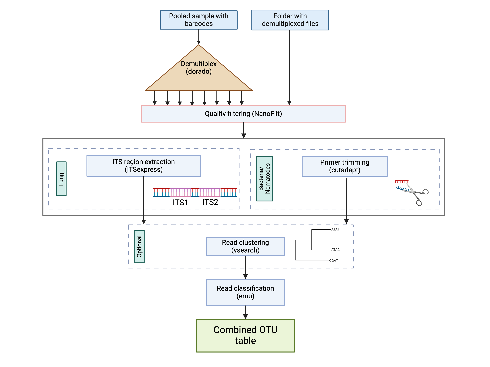

# ezpore

Authors: Ids Willemsen, Robbert van Himbeeck (shared first-author)

## About

`ezpore` is a single-command pipeline to process bacterial (full 16S), fungal (full ITS) or Nematodal (full 18S) reads obtained by Nanopore sequencing.

`ezpore` can perform following steps:

1) demultiplexing (dorado, barcoding kit EXP-NBD196)
2) filtering on length and quality (NanoFilt)
3) primer trimming (cutadapt)
4) ITS region extraction (ITSxpress, for fungal ITS)
5) cluster reads (vsearch)
6) read classification (emu/vsearch)



## Installation & prerequisites

`ezpore` is developed for Linux operating systems and will likely also work on other Unix-like OS (e.g. MacOS). 

Usage on Windows is not supported, however Windows Subsystem for Linux (WSL) can be used (see section "WSL installation instructions").

Be aware that running on windows takes way longer than on a Linux machine!

### WSL installation instructions

Follow these steps to install Windows Subsystem for Linux (WSL) on a Windows 10 or 11 machine.

1) Open PowerShell as Administrator: Press `Windows + X` and select **Windows PowerShell (Admin)** or **Windows Terminal (Admin)**.
2) Install WSL: Run the following command in the PowerShell window:
```
wsl --install
```

### Prerequisite installation instructions

To use `ezpore`, `conda` and `snakemake` need to be installed on your system. To first install `conda` perform following steps:

1) 
```
wget https://repo.anaconda.com/miniconda/Miniconda3-latest-Linux-x86_64.sh #
```
2)
```
bash Miniconda3-latest-Linux-x86_64.sh #
```
navigate trough the interactive installation shell: Choose **yes** by “Do you wish the installer to initialize Miniconda3 by running conda init? [yes|no]" 
   
3) open a new terminal, (base) will appearing at the beginning of every rule.

4) Install snakemake with the following command:
```
conda install snakemake
```


### Downloading and running ezpore
To 'install' `ezpore`:

1) download the [ezpore.zip](https://github.com/ids-willemsen/ezpore/raw/main/ezpore.zip) file from the github and extract it to the directory of your choice. The `ezpore.zip` contains all files necessary for your run.
2) copy your sequencing file (fastq) to the same folder that contains the extracted [ezpore.zip](https://github.com/ids-willemsen/ezpore/raw/main/ezpore.zip) contents
3) In the case of demultiplexed data: in the extraction folder containing the [ezpore.zip](https://github.com/ids-willemsen/ezpore/raw/main/ezpore.zip) contents, create a folder called 'demux' and copy your demultiplexed files to there.
4) Edit the settingsfile.yaml to correspond with your preferred run settings - arguments are explained below.
5) Edit the barcode_files.txt to only contain barcodes you want to be analyzed - in the case this file is empty or not present, the `ezpore` pipeline will use all files.

6) Your resulting folder should contain: 1. The snakefile.smk 2. The settingsfile.yaml 3. The barcode_files.txt 4. The ezpore_conda.yaml 5. Either a non-demultiplexed fastq or a folder called 'demux' containing demultiplexed files!
7) Finally, run the `ezpore` pipeline with the command:

```
snakemake --snakefile snakefile.smk --use-conda --cores all  
```

# The settingsfile

The settingsfile.yaml contains all possible arguments that can be used by ezpore. 

The `settingsfile.yaml` includes following arguments:

| argument | description | input type | default value |
| -------- | ----------- | ------------  | ------------- |
|keep_steps | option to delete steps to avoid directory bloating | True/False | True |
|demultiplex | demultiplexes the data using dorado | True/False | True |
|min | the minimum read length (in bp). Shorter reads are removed | integer | 100 | 
|max |the maximum read length (in bp). Larger reads are removed | INTEGER | 10000 |
|quality | the minimum average read quality to be retained. Reads with lower Q score are removed | INTEGER | 15 |
|trim_primers | removes primers using cutadapt | True/False | True |
|primer_error_rate | the maximum allowed error rate for primer trimming. | UNIT INTERVAL[0-1} | 0.2 |
|clustering | clusters sequences using vsearch | True/False | True |
|cluster_perc | the percentage identity to cluster on using vsearch. | UNIT INTERVAL[0-1} | 0.97 |
|threads | the number of threads are used throughout the pipeline | INTEGER | 24 |
|group | the group of organisms: bacteria (16S_bac), nematodes (18S_nem) or fungi (ITS_fun) | STRING | none |
|barcode_file | the path to your barcode_files.txt| STRING| none |
|input_file | the input file (.fastq) of the analysis, in case demultiplexing is not performed you can leave this empty | .fastq file | none | 
|forward_primer | the primer sequence of your forward primer | STRING| none|
|forward_primer | the primer sequence of your reverse primer | STRING| none|
|classifier | the classifier you would like to use for taxonomic identification| emu/vsearch| none |
|min_abundance | the minimum relative abundance of an organism to be retained by emu | UNIT INTERVAL[0-1] | 0.0001 |
|rank | the taxonomic rank which emu uses to combine output of all files | species,genus, etc. | species | 
|vsearch_id | the minimum percent identity that vsearch will include in your output| 0.97|
|custom_database | use a custom database| True/False| False|
|custom_database_path | The path to your custom database| none|

### Using a custom database
`ezpore` is equipped to automatically download the 16S SILVA database for bacteria, the UNITE ITS database for fungi, and our in-house 18S Nematode database for both 'emu' and 'vsearch' classification. If you prefer to use your own database, this is possible by changing the custom_database argument to 'True' and adding the database path to custom_database_path. In this case, the database files should be present should be in the correct format as used by vsearch/emu. If you choose to use emu, the custom_database_path should lead to a directory containing the taxonomy.tsv and species_taxid.fasta. If you choose to use vsearch, the custom_database_path should lead to a .fasta file vsearch database format. Mind that the `group` should still be set in the settingsfile (e.g. in the case you want to use ITS extraction set it to ITS_fun or if you would like to trim primers use 16S_bac/18S_nem).

### Bugs and requests
If you encounter any bugs or you wish to request additional features, please open an issue on this GitHub page.

### Acknowledgements
We want to thank the creators of Decona (https://github.com/Saskia-Oosterbroek/decona) for their advice in the early stages of creating the `ezpore` pipeline.
